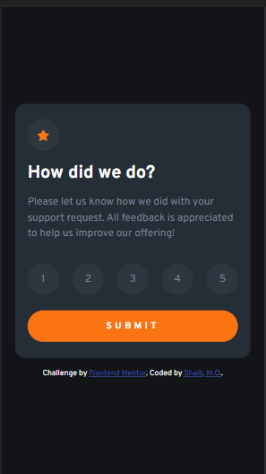
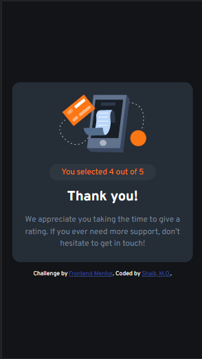
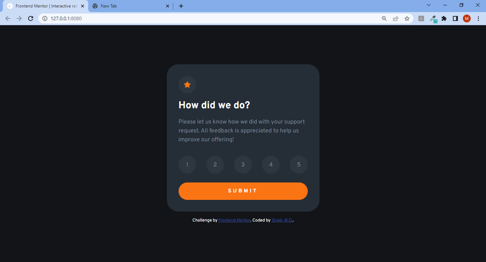

# Frontend Mentor - Interactive rating component solution

This is a solution to the [Interactive rating component challenge on Frontend Mentor](https://www.frontendmentor.io/challenges/interactive-rating-component-koxpeBUmI). Frontend Mentor challenges help you improve your coding skills by building realistic projects.

## Table of contents

- [Overview](#overview)
  - [The challenge](#the-challenge)
  - [Screenshot](#screenshot)
  - [Links](#links)
- [My process](#my-process)
  - [Built with](#built-with)
  - [What I learned](#what-i-learned)
  - [Continued development](#continued-development)
- [Author](#author)

## Overview

### The challenge

Users should be able to:

- View the optimal layout for the app depending on their device's screen size
- See hover states for all interactive elements on the page
- Select and submit a number rating
- See the "Thank you" card state after submitting a rating

### Screenshot

My mobile designs:

My desktop designs:

### Links

- Solution URL: [Add solution URL here](https://your-solution-url.com)
- Live Site URL: [Add live site URL here](https://your-live-site-url.com)

## My process

### Built with

- Semantic HTML5 markup
- CSS custom properties
- Flexbox
- CSS Grid
- JavaScript DOM manipulation
- Mobile-first workflow

### What I learned

I learnt how to write cleaner codes using CSS classes, particularly using JS to manipulate classes to make HTML content be hidden or visible.

### Continued development

I love to improve on my JavaScript skills on DOM manipulation as this is the first challenge that I have undertaken that required a bit of JS. Cheers to many more challenges like this.

## Author

- Frontend Mentor - [@ShaibMO](https://www.frontendmentor.io/profile/ShaibMO)
- Twitter - [@shaib_mosesO](https://www.twitter.com/shaib_mosesO)
